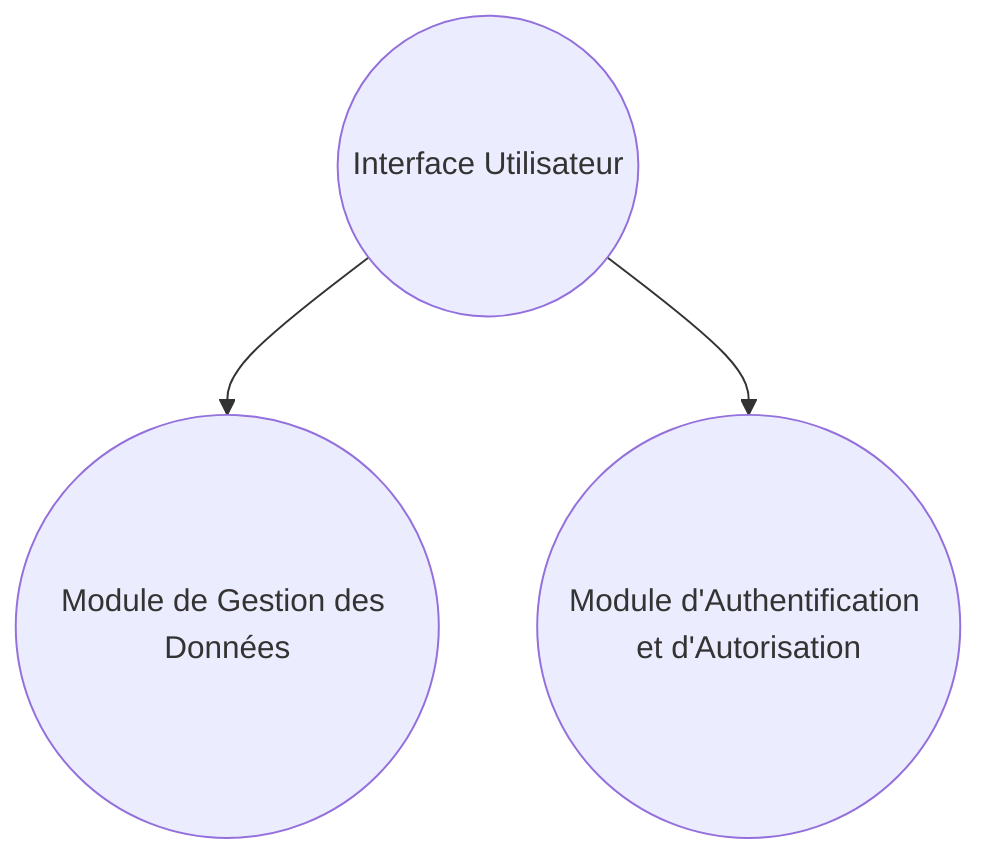

# Développement d'une interface de configuration

Ce document décrit le développement d'une interface de configuration pour une application web donnée.

## Sommaire

- [Introduction](#introduction)
- [Fonctionnalités](#functionalities)
- [Architecture](#architecture)
- [Développement](#development)
  - [Environnement de développement](#development-environment)
  - [Outils de développement](#development-tools)
  - [Implémentation](#implementation)
  - [Test](#test)
- [Déploiement](#deployment)
- [Maintenance](#maintenance)

## Introduction

L'interface de configuration est une application web permettant à l'utilisateur de configurer les paramètres de l'application hôte.

### Objectifs

- Fournir une interface facile à utiliser pour la configuration des paramètres de l'application hôte.
- Garantir la sécurité et la confidentialité des données de configuration.
- Permettre une gestion centralisée des configurations pour plusieurs instances de l'application hôte.

## Fonctionnalités

- Affichage des paramètres de configuration actuels.
- Modification des paramètres de configuration.
- Enregistrement des modifications apportées aux paramètres de configuration.
- Annulation des modifications non enregistrées.
- Validation des données de configuration avant enregistrement.
- Gestion des rôles et des autorisations pour l'accès à l'interface de configuration.

## Architecture

L'interface de configuration est une application web monopage (SPA) comprenant les composants suivants :

- Une interface utilisateur (UI) permettant à l'utilisateur de visualiser et de modifier les paramètres de configuration.
- Un module de gestion des données (DM) pour la gestion des données de configuration.
- Un module d'authentification et d'autorisation (AA) pour la gestion des rôles et des autorisations.

### Diagramme des composants

## Développement

### Environnement de développement

- Système d'exploitation : [système d'exploitation]
- Navigateur web : [navigateur web]
- Éditeur de code : [éditeur de code]

### Outils de développement

- [outil de développement 1]
- [outil de développement 2]
- [outil de développement 3]

### Implémentation

- Langage de programmation : [langage de programmation]
- Framework : [framework]
- Bibliothèque : [bibliothèque]

### Test

- [outil de test 1]
- [outil de test 2]
- [outil de test 3]

## Déploiement

- Hébergement : [hébergement]
- Domaine : [domaine]
- Certificat SSL : [certificat SSL]

## Maintenance

- Mises à jour : [mises à jour]
- Corrections de bogues : [corrections de bogues]
- Améliorations : [améliorations]
